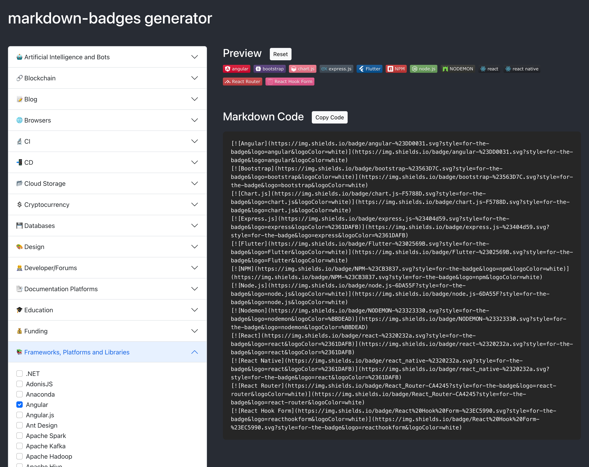

# markdown-badges generator

With this badges generator, you'll be jazzing up your readme files in no time. Just click some boxes and boom, you've got yourself some fancy badges to show off your skills.

Badges retrieved from [ileriayo/markdown-badges](https://github.com/Ileriayo/markdown-badges/tree/master).

### License

This project is licensed under the [MIT License](https://github.com/Spiderpig86/Cirrus/blob/master/LICENSE). See the [LICENSE](LICENSE.md) file for details.
